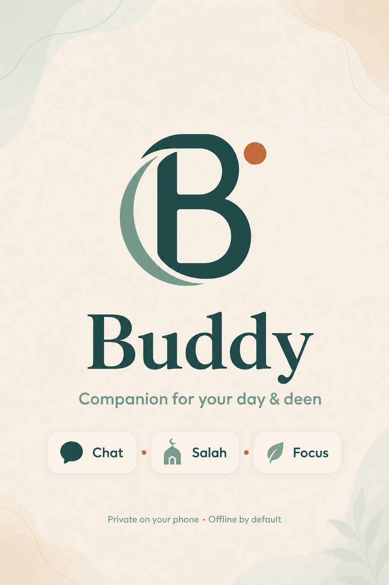
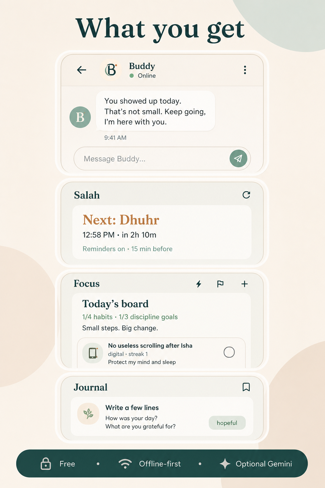

<p align="center">
  
</p>

# Buddy

**A calm, offline-first companion for your day and deen.**

Buddy helps you check in, build gentle habits, stay near salah, and keep a private journal — on your phone, without requiring an account or a paid backend.

Your connection with Allah stays direct. Buddy only supports the routine.

---

## Features

- **Chat companion** — text, voice notes, and photo check-ins with warm, friend-like replies
- **Focus** — habits + discipline goals with streaks and soft reminders
- **Salah** — offline prayer times, next-prayer countdown, configurable reminders
- **Journal** — private reflections stored on-device
- **Care signals** — day/evening check-ins, scenery breaks, scroll pause, journal nudges (times you choose)
- **Optional Gemini** — paste your own free API key for smarter chats; offline mode always works
- **Dark mode** — night-friendly UI
- **Privacy-first** — local Hive storage, no account required

---

## Screenshots / promo

| GitHub banner | Instagram story 1 | Instagram story 2 |
| --- | --- | --- |
|  |  |  |

---

## Run locally

> On Windows, prefer a path **without spaces** (e.g. `C:\dev\buddy`) for reliable Android builds.

```bash
cd C:\dev\buddy
flutter pub get
flutter run
```

### Optional: regenerate icons / splash

```bash
dart run flutter_launcher_icons
dart run flutter_native_splash:create
```

---

## Setup tips

1. Allow **notifications** when prompted  
2. **Settings → City preset** for accurate salah times  
3. Turn on **Prayer reminders** and **Care signals**, then set your times  
4. (Optional) Add a free **Gemini API key** for smarter replies  

---

## Stack

- Flutter / Dart  
- Provider + Hive (local state & storage)  
- `adhan` (offline prayer times)  
- `flutter_local_notifications`  
- Optional Google Gemini via user-supplied key  

---

## Privacy

- Chat, journal, habits, goals, and photos stay on the device  
- No Buddy cloud backend  
- Online AI (if enabled) only runs when you provide your own key  

---

## License

Personal / private project unless otherwise stated. Add a license file if you publish publicly.

---

<p align="center">
  <b>Buddy</b> · Companion for your day & deen
</p>
